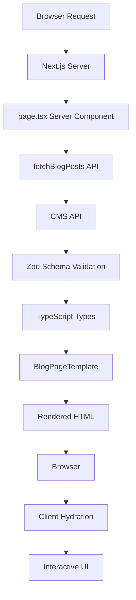

# Design Document: Blog Feature

## Overview

The Blog Feature is a server-side rendered (SSR) blog listing page built with Next.js 16 App Router. It provides a performant, SEO-optimized interface for browsing FarmCredit's blog content with category filtering, pagination, and featured post highlighting.

### Key Design Decisions

1. **Server-Side Rendering (SSR)**: The blog listing page uses Next.js SSR to generate HTML on the server, ensuring optimal SEO and fast initial page loads. This approach provides search engines with fully rendered content and enables dynamic Open Graph meta tags.

2. **URL-Based State Management**: Category filters and pagination state are stored in URL query parameters (`?category=carbon-credits&page=2`). This enables:
   - Shareable URLs that preserve filter/page state
   - Browser back/forward navigation
   - SEO-friendly URLs for filtered views
   - No client-side state management complexity

3. **Atomic Design Pattern**: Components follow atomic design methodology:
   - **Atoms**: Badge, Button, Text (existing)
   - **Molecules**: BlogCard, CategoryFilter, PaginationControl
   - **Organisms**: BlogGrid, FeaturedPostHero
   - **Templates**: BlogPageTemplate
   - **Pages**: app/blog/page.tsx

4. **Progressive Enhancement**: The page works without JavaScript, with enhanced interactivity when JS loads. Category filters and pagination use Next.js Link components for navigation, ensuring functionality even if JS fails.

5. **Type-Safe API Integration**: All CMS API responses are validated using Zod schemas at runtime, then narrowed to TypeScript types. This ensures type safety even with external data sources.

## Architecture

### Component Hierarchy

```
app/blog/page.tsx (Server Component)
└── BlogPageTemplate
    ├── FeaturedPostHero (conditional)
    │   └── BlogCard (featured variant)
    ├── CategoryFilter
    │   └── Button[] (category buttons)
    ├── BlogGrid
    │   └── BlogCard[]
    │       ├── Card (molecule)
    │       ├── Badge (atom)
    │       └── Text (atom)
    └── PaginationControl
        └── Button[] (page navigation)
```

### Data Flow



### File Structure

```
app/
  blog/
    page.tsx                    # Server component, data fetching
    loading.tsx                 # Loading UI (skeleton)
    error.tsx                   # Error boundary
components/
  atoms/
    Badge.tsx                   # Existing
    Button.tsx                  # Existing
    Text.tsx                    # Existing
  molecules/
    Card.tsx                    # Existing
    BlogCard.tsx                # New - displays blog post summary
    CategoryFilter.tsx          # New - category selection UI
    PaginationControl.tsx       # New - page navigation UI
  organisms/
    BlogGrid.tsx                # New - grid layout for blog cards
    FeaturedPostHero.tsx        # New - hero section for featured post
  templates/
    BlogPageTemplate.tsx        # New - page layout composition
lib/
  api/
    blog.ts                     # CMS API client functions
  schemas/
    blog.ts                     # Zod schemas for validation
  types/
    blog.ts                     # TypeScript type definitions
  utils/
    seo.ts                      # SEO meta tag generation
    url.ts                      # URL query parameter helpers
```

## Components and Interfaces

### Molecules

#### BlogCard

Displays a single blog post's summary information. Supports two variants: standard (for grid) and featured (for hero).

**Props:**

```typescript
interface BlogCardProps {
  post: BlogPost;
  variant?: 'standard' | 'featured';
  priority?: boolean; // For image loading priority
}
```

**Composition:**

- Uses `Card` molecule as base
- Uses `Badge` atom for category display
- Uses `Text` atom for title, excerpt, date
- Uses Next.js `Image` for optimized images
- Uses Next.js `Link` for navigation

**Behavior:**

- Standard variant: Displays in grid with vertical layout
- Featured variant: Larger dimensions, horizontal layout on desktop
- Hover state: Subtle elevation increase, border color change
- Click: Navigates to full blog post page
- Image loading: Uses Next.js Image with blur placeholder

#### CategoryFilter

Displays category buttons for filtering blog posts.

**Props:**

```typescript
interface CategoryFilterProps {
  categories: string[];
  selectedCategory: string | null;
  postCounts: Record<string, number>; // Posts per category
}
```

**Composition:**

- Uses `Button` atom with stellar variants
- Horizontal scrollable container on mobile
- Wrapped button group on desktop
- "All" button to clear filter

**Behavior:**

- Selected category: `stellar="primary"` variant
- Unselected categories: `stellar="primary-outline"` variant
- Click: Updates URL with `?category={name}` query parameter
- Displays post count badge on each button
- Keyboard navigation: Arrow keys move between buttons

#### PaginationControl

Displays page navigation controls.

**Props:**

```typescript
interface PaginationControlProps {
  currentPage: number;
  totalPages: number;
  baseUrl: string; // Preserves category filter in URLs
}
```

**Composition:**

- Uses `Button` atom for navigation
- Displays page numbers with ellipsis for large ranges
- Previous/Next buttons with icons

**Behavior:**

- Mobile: Shows only prev/next and current page
- Desktop: Shows page numbers with ellipsis (1 ... 5 6 7 ... 20)
- Disabled state: First page disables prev, last page disables next
- Click: Updates URL with `?page={number}` query parameter
- Scrolls to top of BlogGrid on page change

### Organisms

#### BlogGrid

Displays blog posts in a responsive grid layout.

**Props:**

```typescript
interface BlogGridProps {
  posts: BlogPost[];
}
```

**Composition:**

- CSS Grid layout with responsive columns
- Maps posts to `BlogCard` components
- Empty state message when no posts

**Behavior:**

- 1 column on mobile (< 768px)
- 2 columns on tablet (768px - 1023px)
- 3 columns on desktop (≥ 1024px)
- Gap: 1.5rem between cards
- Smooth transitions on layout changes

#### FeaturedPostHero

Displays the featured blog post in a prominent hero section.

**Props:**

```typescript
interface FeaturedPostHeroProps {
  post: BlogPost;
}
```

**Composition:**

- Uses `BlogCard` with `variant="featured"`
- Full-width container with max-width constraint
- Background gradient overlay on image

**Behavior:**

- Only renders if featured post exists
- Vertical stack on mobile
- Horizontal layout on tablet/desktop
- Image takes 50% width on desktop
- Priority image loading (LCP optimization)

### Templates

#### BlogPageTemplate

Composes all organisms into the complete page layout.

**Props:**

```typescript
interface BlogPageTemplateProps {
  featuredPost: BlogPost | null;
  posts: BlogPost[];
  categories: string[];
  selectedCategory: string | null;
  currentPage: number;
  totalPages: number;
  postCounts: Record<string, number>;
}
```

**Composition:**

- Container with max-width and padding
- Conditional FeaturedPostHero
- CategoryFilter
- BlogGrid
- PaginationControl

**Layout:**

- Max width: 1280px
- Horizontal padding: 1rem (mobile), 2rem (desktop)
- Vertical spacing: 3rem between sections

## Data Models

### BlogPost

```typescript
interface BlogPost {
  id: string;
  slug: string;
  title: string;
  excerpt: string;
  content: string; // Full markdown content (not used on listing page)
  publishedAt: string; // ISO 8601 date string
  updatedAt: string; // ISO 8601 date string
  category: string;
  featuredImage: {
    url: string;
    alt: string;
    width: number;
    height: number;
    blurDataURL?: string; // Base64 blur placeholder
  };
  author: {
    name: string;
    avatar?: string;
  };
  isFeatured: boolean;
  seo: {
    metaTitle?: string;
    metaDescription?: string;
    ogImage?: string;
  };
}
```

### BlogListResponse

```typescript
interface BlogListResponse {
  posts: BlogPost[];
  pagination: {
    currentPage: number;
    totalPages: number;
    totalPosts: number;
    postsPerPage: number;
  };
  categories: string[];
}
```

### Zod Schemas

```typescript
import { z } from 'zod';

const BlogPostSchema = z.object({
  id: z.string(),
  slug: z.string(),
  title: z.string().min(1),
  excerpt: z.string().min(1),
  content: z.string(),
  publishedAt: z.string().datetime(),
  updatedAt: z.string().datetime(),
  category: z.string().min(1),
  featuredImage: z.object({
    url: z.string().url(),
    alt: z.string(),
    width: z.number().positive(),
    height: z.number().positive(),
    blurDataURL: z.string().optional(),
  }),
  author: z.object({
    name: z.string().min(1),
    avatar: z.string().url().optional(),
  }),
  isFeatured: z.boolean(),
  seo: z.object({
    metaTitle: z.string().optional(),
    metaDescription: z.string().optional(),
    ogImage: z.string().url().optional(),
  }),
});

const BlogListResponseSchema = z.object({
  posts: z.array(BlogPostSchema),
  pagination: z.object({
    currentPage: z.number().int().positive(),
    totalPages: z.number().int().positive(),
    totalPosts: z.number().int().nonnegative(),
    postsPerPage: z.number().int().positive(),
  }),
  categories: z.array(z.string()),
});

export type BlogPost = z.infer<typeof BlogPostSchema>;
export type BlogListResponse = z.infer<typeof BlogListResponseSchema>;
```

### API Functions

```typescript
// lib/api/blog.ts
export async function fetchBlogPosts(params: {
  page?: number;
  category?: string;
}): Promise<BlogListResponse> {
  const searchParams = new URLSearchParams();
  if (params.page) searchParams.set('page', params.page.toString());
  if (params.category) searchParams.set('category', params.category);

  const response = await fetch(`${process.env.CMS_API_URL}/blog?${searchParams}`, {
    next: { revalidate: 300 }, // Cache for 5 minutes
  });

  if (!response.ok) {
    throw new Error(`CMS API error: ${response.status}`);
  }

  const data = await response.json();

  // Runtime validation with Zod
  const validated = BlogListResponseSchema.parse(data);

  return validated;
}
```

## Correctness Properties

_A property is a characteristic or behavior that should hold true across all valid executions of a system—essentially, a formal statement about what the system should do. Properties serve as the bridge between human-readable specifications and machine-verifiable correctness guarantees._

### Property 1: Blog Post Rendering Completeness

_For any_ blog post (standard or featured), the rendered BlogCard SHALL display all required fields: featured image, title, excerpt, publication date, and category.

**Validates: Requirements 1.3, 4.3**

### Property 2: Category Filter Completeness

_For any_ set of blog posts, the CategoryFilter SHALL display all unique categories present in the dataset.

**Validates: Requirements 2.1**

### Property 3: Category Filtering Correctness

_For any_ selected category, all displayed blog posts SHALL match that category, and no posts from other categories SHALL be displayed.

**Validates: Requirements 2.2**

### Property 4: Filter Clear Round-Trip

_For any_ blog post dataset, applying a category filter and then clearing it SHALL restore the display to show all posts from the original dataset.

**Validates: Requirements 2.3**

### Property 5: Selected Category Visual Indication

_For any_ selected category in the CategoryFilter, that category button SHALL have both visual styling (stellar="primary") and ARIA attributes (aria-pressed="true") indicating selection.

**Validates: Requirements 2.4, 7.8**

### Property 6: URL State Synchronization

_For any_ category selection or pagination change, the URL query parameters SHALL be updated to reflect the current state, and loading a page with those query parameters SHALL restore that exact state.

**Validates: Requirements 2.5, 2.6, 3.7, 3.8**

### Property 7: Pagination Activation

_For any_ blog post dataset with more than 12 posts, the PaginationControl SHALL be rendered and display the correct total number of pages (Math.ceil(totalPosts / 12)).

**Validates: Requirements 3.1**

### Property 8: Pagination Display Correctness

_For any_ pagination state, the PaginationControl SHALL display both the current page number and total number of pages.

**Validates: Requirements 3.2**

### Property 9: Page Navigation Correctness

_For any_ page number selection, the BlogGrid SHALL display exactly the posts corresponding to that page (posts[(page-1)*12] through posts[page*12-1]).

**Validates: Requirements 3.3**

### Property 10: Pagination Scroll Behavior

_For any_ page navigation action, the window SHALL scroll to the top of the BlogGrid component.

**Validates: Requirements 3.4**

### Property 11: Featured Post Identification

_For any_ blog post dataset containing a post with isFeatured=true, the Blog_System SHALL identify and display that post in the FeaturedPostHero component.

**Validates: Requirements 4.1, 4.2**

### Property 12: Featured Post Navigation

_For any_ featured post, clicking it SHALL navigate to the full blog post page at `/blog/{slug}`.

**Validates: Requirements 4.6**

### Property 13: SEO Meta Tag Completeness

_For any_ blog post page, the rendered HTML SHALL include all required meta tags: title, description, Open Graph tags (og:title, og:description, og:image), Twitter Card tags, canonical URL, and JSON-LD structured data with BlogPosting schema.

**Validates: Requirements 5.2, 5.3, 5.5, 5.6**

### Property 14: Semantic Heading Hierarchy

_For any_ rendered blog page, the heading elements SHALL follow proper hierarchy without skipping levels (h1 → h2 → h3, never h1 → h3).

**Validates: Requirements 5.4**

### Property 15: Image Alt Text Presence

_For any_ rendered blog post image, the img element SHALL have a non-empty alt attribute.

**Validates: Requirements 5.5**

### Property 16: Responsive Grid Layout

_For any_ viewport width, the BlogGrid SHALL display the correct number of columns: 1 column for width < 768px, 2 columns for 768px ≤ width < 1024px, and 3 columns for width ≥ 1024px.

**Validates: Requirements 1.6, 6.1, 6.2, 6.3**

### Property 17: Touch Target Size Compliance

_For any_ interactive element on mobile viewports (< 768px), the element SHALL have minimum dimensions of 44x44 pixels to meet touch target accessibility requirements.

**Validates: Requirements 6.7**

### Property 18: Keyboard Navigation Completeness

_For any_ interactive element (CategoryFilter buttons, PaginationControl buttons, BlogCards), the element SHALL be keyboard accessible (focusable and activatable via Enter/Space keys).

**Validates: Requirements 7.2**

### Property 19: Logical Focus Order

_For any_ blog page, the tab order of interactive elements SHALL match the visual reading order (top to bottom, left to right).

**Validates: Requirements 7.3**

### Property 20: ARIA Label Presence

_For any_ interactive control without visible text (icon buttons, image links), the element SHALL have an accessible name via aria-label, aria-labelledby, or alt text.

**Validates: Requirements 7.4**

### Property 21: Color Contrast Compliance

_For any_ text element, the color contrast ratio between text and background SHALL meet WCAG 2.1 AA requirements: minimum 4.5:1 for normal text, 3:1 for large text (18pt+ or 14pt+ bold).

**Validates: Requirements 7.5**

### Property 22: Dynamic Content Announcement

_For any_ dynamic content change (pagination, filtering), the updated content region SHALL be marked with aria-live="polite" to announce changes to screen readers.

**Validates: Requirements 7.6**

### Property 23: API Error Handling

_For any_ CMS API error response (network error, 4xx, 5xx), the Blog_System SHALL display a user-friendly error message, log the error to console, and provide a retry mechanism.

**Validates: Requirements 1.4, 10.2, 10.6**

### Property 24: Type Validation Error Handling

_For any_ CMS API response that fails Zod schema validation, the Blog_System SHALL catch the validation error, display an error boundary, and log the validation failure details.

**Validates: Requirements 8.6**

### Property 25: Responsive Grid Layout

_For any_ viewport width, the BlogGrid SHALL display the correct number of columns: 1 column for width < 768px, 2 columns for 768px ≤ width < 1024px, and 3 columns for width ≥ 1024px.

**Validates: Requirements 1.6**

## Error Handling

### Error Boundaries

The blog feature implements multiple layers of error handling:

1. **Next.js Error Boundary** (`app/blog/error.tsx`): Catches React rendering errors and displays a fallback UI with retry button.

2. **API Error Handling**: The `fetchBlogPosts` function catches fetch errors and throws typed errors that are handled by the error boundary.

3. **Zod Validation Errors**: Schema validation failures are caught and converted to user-friendly error messages.

### Error States

#### Network Errors

When the CMS API is unreachable or returns a network error:

```typescript
<ErrorState
  title="Unable to load blog posts"
  message="We're having trouble connecting to our content server. Please check your internet connection and try again."
  action={<Button onClick={retry}>Retry</Button>}
/>
```

#### Validation Errors

When the API returns data that doesn't match the expected schema:

```typescript
<ErrorState
  title="Content format error"
  message="We received unexpected data from our content server. Our team has been notified."
  action={<Button onClick={retry}>Retry</Button>}
/>
```

#### Empty States

When no posts are available:

```typescript
<EmptyState
  icon={<FileText className="w-12 h-12 text-muted-foreground" />}
  title="No blog posts yet"
  message="Check back soon for new content about carbon credits and sustainable farming."
/>
```

When a category filter returns no results:

```typescript
<EmptyState
  icon={<Search className="w-12 h-12 text-muted-foreground" />}
  title="No posts found"
  message="No posts match the selected category."
  action={<Button onClick={clearFilter}>Clear filter</Button>}
/>
```

### Image Loading Errors

When a blog post image fails to load:

1. Next.js Image component displays the alt text
2. A placeholder image is shown using the `onError` handler
3. The card remains functional with all other content visible

```typescript
<Image
  src={post.featuredImage.url}
  alt={post.featuredImage.alt}
  onError={(e) => {
    e.currentTarget.src = '/images/blog-placeholder.jpg';
  }}
/>
```

### Loading States

While data is being fetched, the page displays skeleton loaders that match the BlogCard layout:

```typescript
// app/blog/loading.tsx
export default function BlogLoading() {
  return (
    <BlogPageTemplate
      featuredPost={<BlogCardSkeleton variant="featured" />}
      posts={Array(12).fill(null).map((_, i) => (
        <BlogCardSkeleton key={i} />
      ))}
    />
  );
}
```

## Testing Strategy

### Dual Testing Approach

The blog feature uses both unit tests and property-based tests to ensure comprehensive coverage:

- **Unit tests**: Verify specific examples, edge cases, and error conditions
- **Property tests**: Verify universal properties across all inputs

### Property-Based Testing

We'll use **fast-check** (JavaScript/TypeScript property-based testing library) to implement the correctness properties defined above.

**Configuration:**

- Minimum 100 iterations per property test
- Each test references its design document property via comment tag
- Tag format: `// Feature: blog-feature, Property {number}: {property_text}`

**Example Property Test:**

```typescript
import fc from 'fast-check';
import { render, screen } from '@testing-library/react';
import { BlogCard } from '@/components/molecules/BlogCard';

// Feature: blog-feature, Property 1: Blog Post Rendering Completeness
test('BlogCard displays all required fields for any blog post', () => {
  fc.assert(
    fc.property(
      blogPostArbitrary(), // Generator for random BlogPost objects
      (post) => {
        render(<BlogCard post={post} />);

        // All required fields must be present
        expect(screen.getByRole('img')).toBeInTheDocument();
        expect(screen.getByText(post.title)).toBeInTheDocument();
        expect(screen.getByText(post.excerpt)).toBeInTheDocument();
        expect(screen.getByText(post.category)).toBeInTheDocument();
        expect(screen.getByText(formatDate(post.publishedAt))).toBeInTheDocument();
      }
    ),
    { numRuns: 100 }
  );
});
```

**Generators (Arbitraries):**

```typescript
// test/generators/blog.ts
import fc from 'fast-check';

export const blogPostArbitrary = () =>
  fc.record({
    id: fc.uuid(),
    slug: fc.stringMatching(/^[a-z0-9-]+$/),
    title: fc.string({ minLength: 10, maxLength: 100 }),
    excerpt: fc.string({ minLength: 50, maxLength: 200 }),
    content: fc.lorem({ maxCount: 500 }),
    publishedAt: fc.date().map((d) => d.toISOString()),
    updatedAt: fc.date().map((d) => d.toISOString()),
    category: fc.constantFrom('carbon-credits', 'sustainable-farming', 'climate-tech', 'policy'),
    featuredImage: fc.record({
      url: fc.webUrl(),
      alt: fc.string({ minLength: 10, maxLength: 100 }),
      width: fc.integer({ min: 400, max: 1200 }),
      height: fc.integer({ min: 300, max: 800 }),
    }),
    author: fc.record({
      name: fc.fullName(),
      avatar: fc.option(fc.webUrl()),
    }),
    isFeatured: fc.boolean(),
    seo: fc.record({
      metaTitle: fc.option(fc.string({ maxLength: 60 })),
      metaDescription: fc.option(fc.string({ maxLength: 160 })),
      ogImage: fc.option(fc.webUrl()),
    }),
  });
```

### Unit Testing

Unit tests focus on specific examples and edge cases:

**Examples:**

- Page loads and fetches blog posts (Requirement 1.1)
- Loading state displays skeleton loaders (Requirement 10.1)
- Blog listing page has correct meta tags (Requirement 5.1)

**Edge Cases:**

- No featured post exists (Requirement 4.4)
- Zero blog posts returned (Requirement 10.3)
- Category filter returns zero results (Requirement 10.4)
- Image fails to load (Requirement 10.5)
- Pagination boundaries (first/last page button states)
- Responsive breakpoints (mobile/tablet/desktop)

**Example Unit Test:**

```typescript
import { render, screen } from '@testing-library/react';
import { BlogPageTemplate } from '@/components/templates/BlogPageTemplate';

test('does not render hero section when no featured post exists', () => {
  render(
    <BlogPageTemplate
      featuredPost={null}
      posts={mockPosts}
      categories={['carbon-credits']}
      selectedCategory={null}
      currentPage={1}
      totalPages={1}
      postCounts={{ 'carbon-credits': 5 }}
    />
  );

  expect(screen.queryByTestId('featured-post-hero')).not.toBeInTheDocument();
});
```

### Integration Testing

Integration tests verify the complete data flow from API to UI:

```typescript
import { render, screen, waitFor } from '@testing-library/react';
import userEvent from '@testing-library/user-event';
import BlogPage from '@/app/blog/page';

test('category filtering updates URL and displays filtered posts', async () => {
  const user = userEvent.setup();

  render(<BlogPage searchParams={{}} />);

  await waitFor(() => {
    expect(screen.getByText('All Posts')).toBeInTheDocument();
  });

  // Click category filter
  await user.click(screen.getByRole('button', { name: 'Carbon Credits' }));

  // URL should update
  expect(window.location.search).toContain('category=carbon-credits');

  // Only matching posts should display
  const cards = screen.getAllByTestId('blog-card');
  cards.forEach(card => {
    expect(card).toHaveTextContent('Carbon Credits');
  });
});
```

### Accessibility Testing

Automated accessibility testing using jest-axe:

```typescript
import { render } from '@testing-library/react';
import { axe, toHaveNoViolations } from 'jest-axe';
import { BlogPageTemplate } from '@/components/templates/BlogPageTemplate';

expect.extend(toHaveNoViolations);

test('blog page has no accessibility violations', async () => {
  const { container } = render(
    <BlogPageTemplate {...mockProps} />
  );

  const results = await axe(container);
  expect(results).toHaveNoViolations();
});
```

### Visual Regression Testing

Use Playwright for visual regression testing of responsive layouts:

```typescript
import { test, expect } from '@playwright/test';

test('blog grid displays correct columns at different viewports', async ({ page }) => {
  await page.goto('/blog');

  // Mobile
  await page.setViewportSize({ width: 375, height: 667 });
  await expect(page.locator('.blog-grid')).toHaveCSS('grid-template-columns', '1fr');

  // Tablet
  await page.setViewportSize({ width: 768, height: 1024 });
  await expect(page.locator('.blog-grid')).toHaveCSS('grid-template-columns', 'repeat(2, 1fr)');

  // Desktop
  await page.setViewportSize({ width: 1280, height: 800 });
  await expect(page.locator('.blog-grid')).toHaveCSS('grid-template-columns', 'repeat(3, 1fr)');
});
```

### Test Coverage Goals

- **Unit tests**: 80%+ code coverage
- **Property tests**: All 25 correctness properties implemented
- **Integration tests**: All user flows (filtering, pagination, navigation)
- **Accessibility tests**: Zero axe violations
- **Visual regression**: All responsive breakpoints

### Continuous Integration

All tests run on every pull request:

```yaml
# .github/workflows/test.yml
- name: Run unit tests
  run: pnpm test

- name: Run property tests
  run: pnpm test:property

- name: Run integration tests
  run: pnpm test:integration

- name: Run accessibility tests
  run: pnpm test:a11y

- name: Run visual regression tests
  run: pnpm test:visual
```
