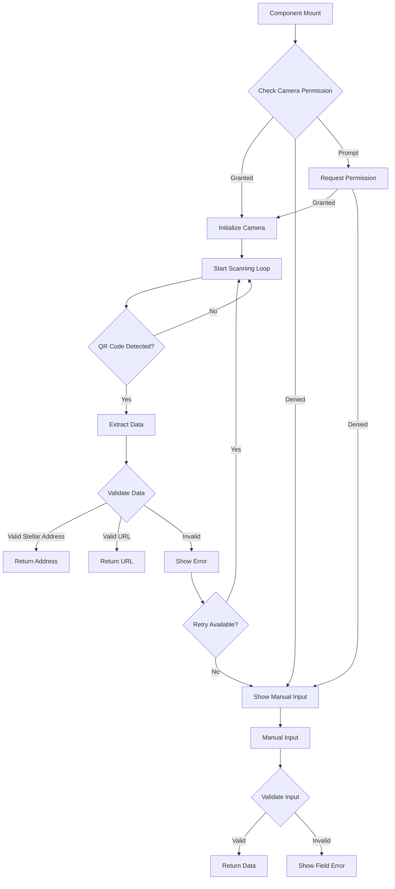
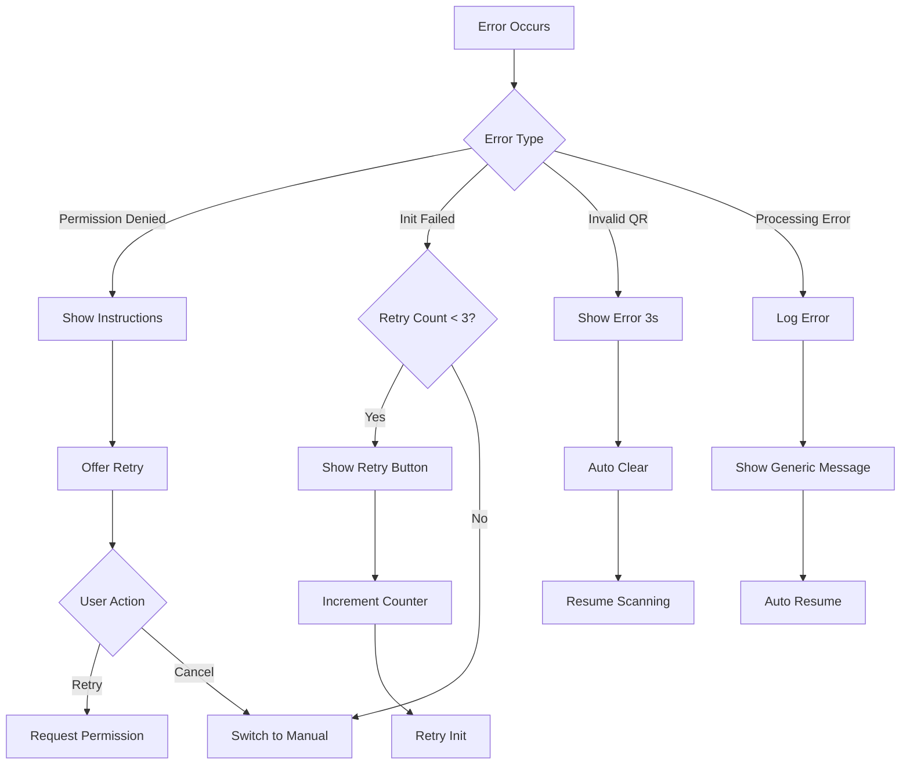

# QR Code Scanner Component - Design Document

## Overview

The QR Code Scanner component is a mobile-first React organism that enables users to scan QR codes containing Stellar payment addresses and verification URLs within the carbon credit marketplace. The component provides camera-based scanning with automatic detection, manual input fallback, and comprehensive error handling to ensure accessibility across all devices and permission scenarios.

### Key Features

- Real-time QR code detection using camera stream
- Automatic validation of Stellar addresses (56 characters, starts with 'G')
- Verification URL parsing and validation
- Manual input fallback for accessibility
- Mobile-first responsive design with orientation support
- Comprehensive error handling and recovery
- ARIA-compliant accessibility
- Performance-optimized resource management

### Technology Stack

- **QR Scanning Library**: html5-qrcode (chosen for its robust browser support, active maintenance, and built-in camera management)
- **Camera API**: MediaDevices.getUserMedia() with polyfills
- **Validation**: Custom Stellar address validator + URL parsing
- **State Management**: React hooks (useState, useEffect, useRef)
- **Styling**: Tailwind CSS with CVA variants
- **Component Architecture**: Atomic design (organism level)

### Library Selection Rationale

After evaluating QR scanning libraries:

- **html5-qrcode**: Selected for production use
  - Pros: Excellent browser support, built-in camera management, active maintenance, TypeScript support
  - Cons: Slightly larger bundle size (~50KB)
  - Best for: Production applications requiring reliability

- **@zxing/library**: Alternative considered
  - Pros: Lightweight, pure JavaScript
  - Cons: Requires manual camera stream management, less documentation
  - Best for: Custom implementations with specific requirements

- **jsQR**: Not selected
  - Pros: Very lightweight
  - Cons: No built-in camera management, requires manual frame processing
  - Best for: Server-side or custom video processing

## Architecture

### Component Hierarchy

```
QRCodeScanner (Organism)
├── CameraView (Molecule)
│   ├── VideoPreview (Atom)
│   ├── ScanningOverlay (Atom)
│   └── ViewfinderGuide (Atom)
├── ScanControls (Molecule)
│   ├── Button (Atom) - Toggle camera/manual
│   ├── Button (Atom) - Retry
│   └── Button (Atom) - Close
├── ManualInputForm (Molecule)
│   ├── Input (Atom) - URL/Address input
│   ├── Button (Atom) - Submit
│   └── Text (Atom) - Error messages
├── StatusIndicator (Molecule)
│   ├── LoadingSpinner (Atom)
│   ├── SuccessAnimation (Atom)
│   └── ErrorMessage (Atom)
└── PermissionPrompt (Molecule)
    ├── Text (Atom) - Instructions
    └── Button (Atom) - Grant permission
```

### State Management

```typescript
interface QRScannerState {
  // Camera state
  cameraStatus: 'idle' | 'requesting' | 'active' | 'denied' | 'error';
  cameraStream: MediaStream | null;

  // Scanning state
  scanStatus: 'idle' | 'scanning' | 'processing' | 'success' | 'error';
  scanResult: string | null;

  // UI state
  mode: 'camera' | 'manual';
  isProcessing: boolean;
  error: ScanError | null;

  // Retry state
  retryCount: number;
  lastScanTime: number;
}

interface ScanError {
  type: 'camera' | 'permission' | 'validation' | 'processing';
  message: string;
  recoverable: boolean;
}
```

### Data Flow



## Components and Interfaces

### Main Component Interface

```typescript
export interface QRCodeScannerProps {
  /** Callback when valid data is scanned/entered */
  onScan: (data: ScanResult) => void;

  /** Callback when scanner is closed */
  onClose?: () => void;

  /** Expected data type to scan */
  expectedType?: 'address' | 'url' | 'both';

  /** Initial mode */
  initialMode?: 'camera' | 'manual';

  /** Custom error messages */
  errorMessages?: Partial<ErrorMessages>;

  /** Enable haptic feedback */
  enableHaptics?: boolean;

  /** Scan rate in FPS */
  scanRate?: number;

  /** Timeout for inactive camera (ms) */
  inactivityTimeout?: number;

  /** Maximum retry attempts */
  maxRetries?: number;

  /** Custom class name */
  className?: string;
}

export interface ScanResult {
  type: 'address' | 'url';
  value: string;
  timestamp: number;
  method: 'camera' | 'manual';
}

export interface ErrorMessages {
  cameraPermissionDenied: string;
  cameraInitFailed: string;
  invalidQRCode: string;
  invalidAddress: string;
  invalidURL: string;
  processingError: string;
}
```

### Sub-Component Interfaces

```typescript
// CameraView Component
export interface CameraViewProps {
  isActive: boolean;
  onScan: (data: string) => void;
  onError: (error: ScanError) => void;
  scanRate: number;
  className?: string;
}

// ManualInputForm Component
export interface ManualInputFormProps {
  expectedType: 'address' | 'url' | 'both';
  onSubmit: (value: string, type: 'address' | 'url') => void;
  onCancel?: () => void;
  error?: string;
  className?: string;
}

// ScanControls Component
export interface ScanControlsProps {
  mode: 'camera' | 'manual';
  canRetry: boolean;
  onToggleMode: () => void;
  onRetry: () => void;
  onClose: () => void;
  className?: string;
}

// StatusIndicator Component
export interface StatusIndicatorProps {
  status: 'idle' | 'scanning' | 'processing' | 'success' | 'error';
  message?: string;
  className?: string;
}
```

### Validation Utilities

```typescript
// Stellar Address Validator
export interface StellarAddressValidator {
  validate(address: string): ValidationResult;
  isValidFormat(address: string): boolean;
  getChecksum(address: string): string;
}

export interface ValidationResult {
  isValid: boolean;
  error?: string;
  normalized?: string;
}

// URL Validator
export interface URLValidator {
  validate(url: string): ValidationResult;
  isVerificationURL(url: string): boolean;
  extractComponents(url: string): URLComponents;
}

export interface URLComponents {
  protocol: string;
  domain: string;
  path: string;
  params: Record<string, string>;
}
```

### Camera Manager

```typescript
export interface CameraManager {
  // Lifecycle
  initialize(): Promise<void>;
  start(): Promise<MediaStream>;
  stop(): void;
  pause(): void;
  resume(): void;

  // State
  getStatus(): CameraStatus;
  getStream(): MediaStream | null;

  // Permissions
  requestPermission(): Promise<PermissionState>;
  checkPermission(): Promise<PermissionState>;

  // Configuration
  setConstraints(constraints: MediaStreamConstraints): void;
  getCapabilities(): MediaTrackCapabilities | null;
}

export type CameraStatus = 'idle' | 'requesting' | 'active' | 'paused' | 'denied' | 'error';
export type PermissionState = 'granted' | 'denied' | 'prompt';
```

## Data Models

### Core Data Types

```typescript
// Scan Result Types
export type ScanDataType = 'stellar-address' | 'verification-url' | 'unknown';

export interface ScannedData {
  raw: string;
  type: ScanDataType;
  parsed: StellarAddress | VerificationURL | null;
  timestamp: number;
  confidence: number;
}

export interface StellarAddress {
  address: string;
  network: 'mainnet' | 'testnet';
  isValid: boolean;
}

export interface VerificationURL {
  url: string;
  certificateId?: string;
  projectId?: string;
  isValid: boolean;
}

// Error Types
export type ErrorType =
  | 'camera-permission-denied'
  | 'camera-init-failed'
  | 'camera-stream-error'
  | 'invalid-qr-data'
  | 'invalid-stellar-address'
  | 'invalid-verification-url'
  | 'processing-timeout'
  | 'unknown-error';

export interface ScanError {
  type: ErrorType;
  message: string;
  recoverable: boolean;
  retryable: boolean;
  timestamp: number;
  details?: unknown;
}

// Camera Configuration
export interface CameraConfig {
  facingMode: 'user' | 'environment';
  width: { ideal: number; max: number };
  height: { ideal: number; max: number };
  aspectRatio: number;
  frameRate: { ideal: number; max: number };
}

// Scanner Configuration
export interface ScannerConfig {
  scanRate: number; // FPS
  debounceDelay: number; // ms
  inactivityTimeout: number; // ms
  maxRetries: number;
  enableHaptics: boolean;
  enableSound: boolean;
}
```

### State Machine

```typescript
export type ScannerPhase =
  | 'initializing'
  | 'requesting-permission'
  | 'camera-active'
  | 'scanning'
  | 'processing'
  | 'success'
  | 'error'
  | 'manual-input'
  | 'inactive';

export interface ScannerStateMachine {
  phase: ScannerPhase;
  canTransitionTo(nextPhase: ScannerPhase): boolean;
  transition(nextPhase: ScannerPhase): void;
  getAvailableActions(): ScannerAction[];
}

export type ScannerAction =
  | 'start-camera'
  | 'stop-camera'
  | 'retry-scan'
  | 'switch-to-manual'
  | 'switch-to-camera'
  | 'submit-manual'
  | 'close';
```

## Implementation Details

### Camera Integration

```typescript
// Camera initialization with html5-qrcode
import { Html5Qrcode } from 'html5-qrcode';

class CameraService {
  private scanner: Html5Qrcode | null = null;
  private stream: MediaStream | null = null;
  private isScanning = false;

  async initialize(elementId: string): Promise<void> {
    this.scanner = new Html5Qrcode(elementId);
  }

  async start(config: CameraConfig, onScan: (data: string) => void): Promise<void> {
    if (!this.scanner) throw new Error('Scanner not initialized');

    const qrConfig = {
      fps: config.frameRate.ideal,
      qrbox: { width: 250, height: 250 },
      aspectRatio: config.aspectRatio,
    };

    await this.scanner.start({ facingMode: config.facingMode }, qrConfig, onScan, (error) =>
      console.debug('Scan error:', error)
    );

    this.isScanning = true;
  }

  async stop(): Promise<void> {
    if (this.scanner && this.isScanning) {
      await this.scanner.stop();
      this.isScanning = false;
    }
  }

  async cleanup(): Promise<void> {
    await this.stop();
    if (this.scanner) {
      await this.scanner.clear();
      this.scanner = null;
    }
  }
}
```

### Stellar Address Validation

```typescript
// Stellar address validation logic
export class StellarAddressValidator {
  private static readonly ADDRESS_LENGTH = 56;
  private static readonly ADDRESS_PREFIX = 'G';
  private static readonly VALID_CHARS = /^[A-Z2-7]+$/;

  static validate(address: string): ValidationResult {
    // Trim whitespace
    const trimmed = address.trim();

    // Check length
    if (trimmed.length !== this.ADDRESS_LENGTH) {
      return {
        isValid: false,
        error: `Address must be exactly ${this.ADDRESS_LENGTH} characters`,
      };
    }

    // Check prefix
    if (!trimmed.startsWith(this.ADDRESS_PREFIX)) {
      return {
        isValid: false,
        error: `Address must start with '${this.ADDRESS_PREFIX}'`,
      };
    }

    // Check character set (base32)
    if (!this.VALID_CHARS.test(trimmed)) {
      return {
        isValid: false,
        error: 'Address contains invalid characters',
      };
    }

    // Validate checksum using Stellar SDK
    try {
      const isValid = StrKey.isValidEd25519PublicKey(trimmed);
      return {
        isValid,
        normalized: trimmed,
        error: isValid ? undefined : 'Invalid address checksum',
      };
    } catch (error) {
      return {
        isValid: false,
        error: 'Address validation failed',
      };
    }
  }
}
```

### URL Validation

```typescript
// Verification URL validation
export class VerificationURLValidator {
  private static readonly ALLOWED_PROTOCOLS = ['https:', 'http:'];
  private static readonly URL_PATTERN = /^https?:\/\/.+/i;

  static validate(urlString: string): ValidationResult {
    try {
      const url = new URL(urlString);

      // Check protocol
      if (!this.ALLOWED_PROTOCOLS.includes(url.protocol)) {
        return {
          isValid: false,
          error: 'URL must use HTTP or HTTPS protocol',
        };
      }

      // Check domain exists
      if (!url.hostname) {
        return {
          isValid: false,
          error: 'URL must have a valid domain',
        };
      }

      return {
        isValid: true,
        normalized: url.toString(),
      };
    } catch (error) {
      return {
        isValid: false,
        error: 'Invalid URL format',
      };
    }
  }

  static isVerificationURL(url: string): boolean {
    // Check if URL contains verification-related paths
    const verificationPatterns = [/\/verify\//i, /\/certificate\//i, /\/retirement\//i];

    return verificationPatterns.some((pattern) => pattern.test(url));
  }
}
```

### Debouncing and Performance

```typescript
// Debounce utility for scan results
export function useDebouncedScan(
  callback: (data: string) => void,
  delay: number
): (data: string) => void {
  const timeoutRef = useRef<NodeJS.Timeout>();
  const lastScanRef = useRef<string>('');
  const lastTimeRef = useRef<number>(0);

  return useCallback(
    (data: string) => {
      const now = Date.now();

      // Prevent duplicate scans within delay period
      if (data === lastScanRef.current && now - lastTimeRef.current < delay) {
        return;
      }

      // Clear existing timeout
      if (timeoutRef.current) {
        clearTimeout(timeoutRef.current);
      }

      // Set new timeout
      timeoutRef.current = setTimeout(() => {
        lastScanRef.current = data;
        lastTimeRef.current = now;
        callback(data);
      }, delay);
    },
    [callback, delay]
  );
}
```

### Resource Cleanup

```typescript
// Cleanup hook for camera resources
export function useCameraCleanup(cameraService: CameraService | null) {
  useEffect(() => {
    return () => {
      // Cleanup on unmount
      if (cameraService) {
        cameraService.cleanup().catch(console.error);
      }
    };
  }, [cameraService]);

  // Cleanup on visibility change
  useEffect(() => {
    const handleVisibilityChange = () => {
      if (document.hidden && cameraService) {
        cameraService.stop().catch(console.error);
      }
    };

    document.addEventListener('visibilitychange', handleVisibilityChange);
    return () => {
      document.removeEventListener('visibilitychange', handleVisibilityChange);
    };
  }, [cameraService]);
}
```

### Responsive Design Implementation

```typescript
// Responsive camera configuration
export function useCameraConfig(): CameraConfig {
  const [config, setConfig] = useState<CameraConfig>(() => ({
    facingMode: 'environment',
    width: { ideal: 1280, max: 1920 },
    height: { ideal: 720, max: 1080 },
    aspectRatio: 4 / 3,
    frameRate: { ideal: 10, max: 30 },
  }));

  useEffect(() => {
    const updateConfig = () => {
      const isPortrait = window.innerHeight > window.innerWidth;
      const isMobile = window.innerWidth < 768;

      setConfig({
        facingMode: 'environment',
        width: {
          ideal: isMobile ? 640 : 1280,
          max: isMobile ? 1280 : 1920,
        },
        height: {
          ideal: isMobile ? 480 : 720,
          max: isMobile ? 720 : 1080,
        },
        aspectRatio: isPortrait ? 3 / 4 : 4 / 3,
        frameRate: { ideal: 10, max: isMobile ? 15 : 30 },
      });
    };

    updateConfig();
    window.addEventListener('resize', updateConfig);
    window.addEventListener('orientationchange', updateConfig);

    return () => {
      window.removeEventListener('resize', updateConfig);
      window.removeEventListener('orientationchange', updateConfig);
    };
  }, []);

  return config;
}
```

### CVA Variants

```typescript
// Component variants using CVA
import { cva } from 'class-variance-authority';

export const scannerVariants = cva(
  'relative flex flex-col overflow-hidden rounded-lg border bg-background',
  {
    variants: {
      mode: {
        camera: 'aspect-[4/3]',
        manual: 'aspect-auto',
      },
      status: {
        idle: 'border-border',
        scanning: 'border-stellar-blue/50',
        success: 'border-stellar-green/50',
        error: 'border-destructive/50',
      },
      size: {
        sm: 'max-w-sm',
        md: 'max-w-md',
        lg: 'max-w-lg',
        full: 'w-full',
      },
    },
    defaultVariants: {
      mode: 'camera',
      status: 'idle',
      size: 'full',
    },
  }
);

export const viewfinderVariants = cva('absolute inset-0 pointer-events-none', {
  variants: {
    state: {
      idle: 'border-white/50',
      scanning: 'border-stellar-blue animate-pulse',
      success: 'border-stellar-green',
      error: 'border-destructive',
    },
  },
  defaultVariants: {
    state: 'idle',
  },
});

export const statusIndicatorVariants = cva(
  'flex items-center gap-2 rounded-lg px-4 py-2 text-sm font-medium',
  {
    variants: {
      status: {
        scanning: 'bg-stellar-blue/10 text-stellar-blue',
        processing: 'bg-stellar-purple/10 text-stellar-purple',
        success: 'bg-stellar-green/10 text-stellar-green',
        error: 'bg-destructive/10 text-destructive',
      },
    },
  }
);
```

### Accessibility Implementation

```typescript
// ARIA live region for status updates
export function ScannerStatusAnnouncer({ status, message }: { status: string; message?: string }) {
  return (
    <div
      role="status"
      aria-live="polite"
      aria-atomic="true"
      className="sr-only"
    >
      {status === 'scanning' && 'Scanning for QR code'}
      {status === 'processing' && 'Processing scanned data'}
      {status === 'success' && `Success: ${message}`}
      {status === 'error' && `Error: ${message}`}
    </div>
  );
}

// Keyboard navigation support
export function useScannerKeyboard(
  onToggleMode: () => void,
  onRetry: () => void,
  onClose: () => void
) {
  useEffect(() => {
    const handleKeyDown = (event: KeyboardEvent) => {
      // Escape to close
      if (event.key === 'Escape') {
        onClose();
      }

      // M to toggle mode
      if (event.key === 'm' || event.key === 'M') {
        onToggleMode();
      }

      // R to retry
      if (event.key === 'r' || event.key === 'R') {
        onRetry();
      }
    };

    window.addEventListener('keydown', handleKeyDown);
    return () => window.removeEventListener('keydown', handleKeyDown);
  }, [onToggleMode, onRetry, onClose]);
}
```

## Correctness Properties

A property is a characteristic or behavior that should hold true across all valid executions of a system—essentially, a formal statement about what the system should do. Properties serve as the bridge between human-readable specifications and machine-verifiable correctness guarantees.

### Property Reflection

After analyzing all acceptance criteria, I identified several areas where properties can be consolidated:

- **Camera permission handling (1.2, 1.3, 1.4)**: These can be combined into a single property about state transitions based on permission status
- **Data validation (3.1, 3.2)**: Both URL and address validation can be covered by a single property about data type detection
- **Resource cleanup (9.1, 9.3)**: Both unmount and navigation cleanup can be combined into a single property about resource release
- **Accessibility announcements (7.3, 7.4)**: Status and error announcements can be combined into a single property about ARIA live region updates
- **Visual feedback (8.1, 8.2, 8.3)**: Different visual states can be combined into a property about state-to-visual-feedback mapping

### Property 1: Camera Permission State Transitions

For any camera permission state (granted, denied, pending), the scanner UI should display the appropriate corresponding interface: camera view for granted, manual input for denied, and loading indicator for pending.

**Validates: Requirements 1.2, 1.3, 1.4**

### Property 2: Camera Initialization Fallback

For any camera initialization failure, the system should both log the error and display the manual input form as a fallback.

**Validates: Requirements 1.5**

### Property 3: Continuous Scanning During Active Camera

For any time period where the camera stream is active, the scanner should be processing frames at the configured scan rate (minimum 10 FPS).

**Validates: Requirements 2.1, 2.5**

### Property 4: QR Detection to Data Extraction

For any detected QR code, the system should extract the encoded data from it.

**Validates: Requirements 2.2**

### Property 5: Scan Success Feedback Timing

For any successful QR code scan, visual feedback should appear within 200ms of detection.

**Validates: Requirements 2.3**

### Property 6: Haptic Feedback on Supported Devices

For any successful QR code scan on a device with haptic capabilities, haptic feedback should be triggered.

**Validates: Requirements 2.4**

### Property 7: Data Type Validation

For any extracted QR data, the parser should validate whether it matches the Verification URL format or the Payment Address format (or neither).

**Validates: Requirements 3.1, 3.2**

### Property 8: URL Component Extraction

For any valid verification URL, the parser should successfully extract the URL components (protocol, domain, path, parameters).

**Validates: Requirements 3.3**

### Property 9: Stellar Address Format Validation

For any string, the Stellar address validator should correctly identify whether it matches the format: exactly 56 characters, starts with 'G', and contains only valid base32 characters.

**Validates: Requirements 3.4, 3.6**

### Property 10: Invalid Data Error Display

For any scanned data that is neither a valid verification URL nor a valid payment address, the scanner should display an error message.

**Validates: Requirements 3.5**

### Property 11: Permission Denied Help Message

For any camera permission denial, the scanner should display a message explaining how to enable camera permissions.

**Validates: Requirements 4.1**

### Property 12: Error Message Display Duration

For any invalid QR code scan, the error message should be displayed for exactly 3 seconds.

**Validates: Requirements 4.2**

### Property 13: Camera Error Recovery UI

For any camera error, the scanner should provide a retry button to the user.

**Validates: Requirements 4.3**

### Property 14: Retry Triggers Reinitialization

For any retry button click, the camera module should attempt to reinitialize the camera.

**Validates: Requirements 4.4**

### Property 15: Retry Limit Fallback

For any sequence of 3 consecutive failed camera initialization attempts, the scanner should permanently switch to manual input mode.

**Validates: Requirements 4.5**

### Property 16: Manual Mode Form Display

For any time the scanner is in manual input mode, the manual input form should be displayed with input fields for URL or address.

**Validates: Requirements 5.2**

### Property 17: Manual Input Validation

For any manual input submission, the parser should validate the entered data before accepting it.

**Validates: Requirements 5.3**

### Property 18: Manual Input Error Feedback

For any failed manual input validation, the form should display field-specific error messages indicating what is wrong.

**Validates: Requirements 5.4**

### Property 19: Paste Functionality Support

For any paste event in the manual input form, the pasted content should be correctly inserted into the input field.

**Validates: Requirements 5.5**

### Property 20: Mobile Full Width Layout

For any viewport width less than 768px (mobile), the scanner should occupy the full viewport width.

**Validates: Requirements 6.1**

### Property 21: Camera Preview Aspect Ratio

For any camera preview display, the aspect ratio should be maintained at 4:3.

**Validates: Requirements 6.2**

### Property 22: Orientation-Based Layout

For any device orientation (portrait or landscape), the scanner should position controls appropriately: below the preview in portrait, beside the preview in landscape.

**Validates: Requirements 6.3, 6.4**

### Property 23: Touch Zoom Support

For any device with touch zoom capabilities, the scanner should respond to pinch-to-zoom gestures on the camera preview.

**Validates: Requirements 6.5**

### Property 24: Keyboard Navigation

For any interactive element in the scanner, it should be reachable and operable via keyboard navigation (Tab, Enter, Escape).

**Validates: Requirements 7.1**

### Property 25: ARIA Label Presence

For any button or control in the scanner, it should have an associated ARIA label for screen reader accessibility.

**Validates: Requirements 7.2**

### Property 26: Screen Reader Status Announcements

For any status change (scanning, processing, success, error), the scanner should announce the update to screen readers via ARIA live regions.

**Validates: Requirements 7.3, 7.4**

### Property 27: Form Label Association

For any input field in the manual input form, it should have a properly associated label element.

**Validates: Requirements 7.5**

### Property 28: Visual State Feedback

For any scanner state (idle, scanning, success, error), the scanner should display the corresponding visual feedback: animated indicator for scanning, success animation for success, error styling for error.

**Validates: Requirements 8.1, 8.2, 8.3**

### Property 29: Stellar Color Palette Usage

For any visual state in the scanner, it should use the appropriate Stellar brand color: stellar-blue for primary actions, stellar-green for success, destructive for errors.

**Validates: Requirements 8.5**

### Property 30: Resource Cleanup on Unmount

For any component unmount or navigation away from the scanner, the camera module should immediately release the camera stream and all associated resources.

**Validates: Requirements 9.1, 9.3**

### Property 31: Inactivity Timeout

For any 60-second period of scanner inactivity, the camera module should pause the camera stream to conserve resources.

**Validates: Requirements 9.2**

### Property 32: Hardware Acceleration Usage

For any device with hardware acceleration capabilities for video processing, the scanner should utilize hardware acceleration.

**Validates: Requirements 9.4**

### Property 33: Scan Result Debouncing

For any sequence of identical scan results within a 500ms window, only the first result should be processed, and subsequent duplicates should be ignored.

**Validates: Requirements 9.5**

## Error Handling

### Error Classification

The QR Code Scanner implements a comprehensive error handling strategy that categorizes errors by type, severity, and recoverability:

```typescript
export enum ErrorSeverity {
  INFO = 'info',
  WARNING = 'warning',
  ERROR = 'error',
  CRITICAL = 'critical',
}

export interface ErrorContext {
  type: ErrorType;
  severity: ErrorSeverity;
  message: string;
  userMessage: string;
  recoverable: boolean;
  retryable: boolean;
  retryCount?: number;
  timestamp: number;
  details?: unknown;
  stack?: string;
}
```

### Error Types and Handling Strategies

#### 1. Camera Permission Errors

**Error Type**: `camera-permission-denied`
**Severity**: ERROR
**Recoverable**: Yes (via manual input)
**Retryable**: Yes (user can grant permission in settings)

**Handling Strategy**:

- Display clear instructions on how to enable camera permissions
- Provide a "Try Again" button to re-request permissions
- Automatically fall back to manual input mode
- Show platform-specific instructions (iOS, Android, Desktop)

```typescript
const handlePermissionError = (error: PermissionError) => {
  const instructions = getPlatformInstructions();
  setError({
    type: 'camera-permission-denied',
    severity: ErrorSeverity.ERROR,
    message: 'Camera permission denied',
    userMessage: `Camera access is required to scan QR codes. ${instructions}`,
    recoverable: true,
    retryable: true,
    timestamp: Date.now(),
  });
  setMode('manual');
};
```

#### 2. Camera Initialization Errors

**Error Type**: `camera-init-failed`
**Severity**: ERROR
**Recoverable**: Yes (via retry or manual input)
**Retryable**: Yes (up to 3 attempts)

**Handling Strategy**:

- Log detailed error information for debugging
- Display user-friendly error message
- Provide retry button with attempt counter
- Fall back to manual input after 3 failed attempts
- Check for common issues (camera in use, hardware failure)

```typescript
const handleInitError = async (error: Error, retryCount: number) => {
  console.error('Camera initialization failed:', error);

  if (retryCount >= MAX_RETRIES) {
    setError({
      type: 'camera-init-failed',
      severity: ErrorSeverity.CRITICAL,
      message: 'Camera initialization failed after maximum retries',
      userMessage: 'Unable to access camera. Please use manual input.',
      recoverable: true,
      retryable: false,
      retryCount,
      timestamp: Date.now(),
      details: error,
    });
    setMode('manual');
  } else {
    setError({
      type: 'camera-init-failed',
      severity: ErrorSeverity.WARNING,
      message: 'Camera initialization failed',
      userMessage: `Camera initialization failed. Retry attempt ${retryCount + 1} of ${MAX_RETRIES}.`,
      recoverable: true,
      retryable: true,
      retryCount,
      timestamp: Date.now(),
    });
  }
};
```

#### 3. QR Code Validation Errors

**Error Type**: `invalid-qr-data`
**Severity**: WARNING
**Recoverable**: Yes (user can scan again)
**Retryable**: Yes (immediate)

**Handling Strategy**:

- Display error message for 3 seconds
- Continue scanning automatically
- Provide specific feedback about what's wrong
- Suggest correct format

```typescript
const handleValidationError = (data: string, validationType: 'address' | 'url') => {
  const errorMessage =
    validationType === 'address'
      ? 'Invalid Stellar address. Address must be 56 characters starting with "G".'
      : 'Invalid verification URL. Please scan a valid verification link.';

  setError({
    type: 'invalid-qr-data',
    severity: ErrorSeverity.WARNING,
    message: `Invalid ${validationType} format`,
    userMessage: errorMessage,
    recoverable: true,
    retryable: true,
    timestamp: Date.now(),
    details: { data, validationType },
  });

  // Auto-clear error after 3 seconds
  setTimeout(() => setError(null), 3000);
};
```

#### 4. Processing Errors

**Error Type**: `processing-timeout` | `processing-error`
**Severity**: WARNING
**Recoverable**: Yes
**Retryable**: Yes

**Handling Strategy**:

- Log error details for debugging
- Display generic error message to user
- Continue scanning automatically
- Track error frequency for monitoring

```typescript
const handleProcessingError = (error: Error) => {
  console.error('QR processing error:', error);

  setError({
    type: 'processing-error',
    severity: ErrorSeverity.WARNING,
    message: 'Failed to process QR code',
    userMessage: 'Unable to process QR code. Please try again.',
    recoverable: true,
    retryable: true,
    timestamp: Date.now(),
    details: error,
  });

  // Auto-clear and resume scanning
  setTimeout(() => {
    setError(null);
    resumeScanning();
  }, 2000);
};
```

### Error Recovery Flows



### Error Logging and Monitoring

```typescript
interface ErrorLog {
  sessionId: string;
  timestamp: number;
  error: ErrorContext;
  userAgent: string;
  deviceInfo: DeviceInfo;
  scannerState: ScannerState;
}

class ErrorLogger {
  private logs: ErrorLog[] = [];

  log(error: ErrorContext, state: ScannerState): void {
    const log: ErrorLog = {
      sessionId: this.getSessionId(),
      timestamp: Date.now(),
      error,
      userAgent: navigator.userAgent,
      deviceInfo: this.getDeviceInfo(),
      scannerState: state,
    };

    this.logs.push(log);

    // Send to monitoring service for critical errors
    if (error.severity === ErrorSeverity.CRITICAL) {
      this.sendToMonitoring(log);
    }
  }

  getErrorStats(): ErrorStats {
    return {
      total: this.logs.length,
      byType: this.groupByType(),
      bySeverity: this.groupBySeverity(),
      recoveryRate: this.calculateRecoveryRate(),
    };
  }
}
```

### User-Facing Error Messages

All error messages follow these principles:

- **Clear**: Explain what went wrong in simple terms
- **Actionable**: Tell users what they can do to fix it
- **Contextual**: Provide platform-specific instructions when needed
- **Friendly**: Use supportive, non-technical language

```typescript
export const ERROR_MESSAGES: Record<ErrorType, string> = {
  'camera-permission-denied':
    'Camera access is needed to scan QR codes. Please enable camera permissions in your browser settings.',
  'camera-init-failed':
    'Unable to start the camera. Please check that no other app is using it and try again.',
  'camera-stream-error': 'Camera connection lost. Please check your camera and try again.',
  'invalid-qr-data': "This QR code doesn't contain a valid address or verification link.",
  'invalid-stellar-address':
    'Invalid Stellar address. Addresses must be 56 characters starting with "G".',
  'invalid-verification-url':
    'Invalid verification URL. Please scan a valid certificate verification link.',
  'processing-timeout': 'Processing took too long. Please try scanning again.',
  'unknown-error': 'Something went wrong. Please try again or use manual input.',
};
```

## Testing Strategy

### Overview

The QR Code Scanner requires comprehensive testing across multiple dimensions: unit tests for individual functions, property-based tests for universal behaviors, integration tests for component interactions, and end-to-end tests for user workflows. This dual testing approach ensures both specific edge cases and general correctness are validated.

### Testing Approach

**Dual Testing Philosophy**:

- **Unit Tests**: Validate specific examples, edge cases, and error conditions
- **Property-Based Tests**: Verify universal properties across all inputs
- **Integration Tests**: Validate component interactions and state management
- **E2E Tests**: Validate complete user workflows

**Balance Principle**: Unit tests focus on concrete scenarios and integration points, while property-based tests handle comprehensive input coverage through randomization. Together, they provide complete confidence in correctness.

### Property-Based Testing Configuration

**Library**: fast-check (for TypeScript/JavaScript)
**Configuration**:

- Minimum 100 iterations per property test
- Seed-based reproducibility for failed tests
- Shrinking enabled for minimal counterexamples
- Timeout: 5000ms per property test

**Tagging Convention**: Each property test must reference its design document property:

```typescript
// Feature: qr-code-scanner, Property 9: Stellar Address Format Validation
```

### Unit Testing

#### 1. Validation Functions

```typescript
describe('StellarAddressValidator', () => {
  describe('validate', () => {
    it('should accept valid Stellar address', () => {
      const validAddress = 'GBRPYHIL2CI3FNQ4BXLFMNDLFJUNPU2HY3ZMFSHONUCEOASW7QC7OX2H';
      const result = StellarAddressValidator.validate(validAddress);
      expect(result.isValid).toBe(true);
      expect(result.normalized).toBe(validAddress);
    });

    it('should reject address with wrong length', () => {
      const shortAddress = 'GBRPYHIL2CI3FNQ4BXLFMNDLFJUNPU2HY3ZMFSHONUCEOASW7QC7OX';
      const result = StellarAddressValidator.validate(shortAddress);
      expect(result.isValid).toBe(false);
      expect(result.error).toContain('56 characters');
    });

    it('should reject address with wrong prefix', () => {
      const wrongPrefix = 'ABRPYHIL2CI3FNQ4BXLFMNDLFJUNPU2HY3ZMFSHONUCEOASW7QC7OX2H';
      const result = StellarAddressValidator.validate(wrongPrefix);
      expect(result.isValid).toBe(false);
      expect(result.error).toContain('start with');
    });

    it('should reject address with invalid characters', () => {
      const invalidChars = 'GBRPYHIL2CI3FNQ4BXLFMNDLFJUNPU2HY3ZMFSHONUCEOASW7QC7OX2!';
      const result = StellarAddressValidator.validate(invalidChars);
      expect(result.isValid).toBe(false);
      expect(result.error).toContain('invalid characters');
    });

    it('should trim whitespace from address', () => {
      const addressWithSpaces = '  GBRPYHIL2CI3FNQ4BXLFMNDLFJUNPU2HY3ZMFSHONUCEOASW7QC7OX2H  ';
      const result = StellarAddressValidator.validate(addressWithSpaces);
      expect(result.isValid).toBe(true);
    });
  });
});

describe('VerificationURLValidator', () => {
  describe('validate', () => {
    it('should accept valid HTTPS URL', () => {
      const validUrl = 'https://example.com/verify/certificate/123';
      const result = VerificationURLValidator.validate(validUrl);
      expect(result.isValid).toBe(true);
    });

    it('should accept valid HTTP URL', () => {
      const httpUrl = 'http://example.com/verify';
      const result = VerificationURLValidator.validate(httpUrl);
      expect(result.isValid).toBe(true);
    });

    it('should reject URL with invalid protocol', () => {
      const ftpUrl = 'ftp://example.com/file';
      const result = VerificationURLValidator.validate(ftpUrl);
      expect(result.isValid).toBe(false);
      expect(result.error).toContain('HTTP or HTTPS');
    });

    it('should reject malformed URL', () => {
      const malformed = 'not-a-url';
      const result = VerificationURLValidator.validate(malformed);
      expect(result.isValid).toBe(false);
      expect(result.error).toContain('Invalid URL');
    });
  });

  describe('isVerificationURL', () => {
    it('should identify verification URLs', () => {
      expect(VerificationURLValidator.isVerificationURL('https://example.com/verify/123')).toBe(
        true
      );
      expect(
        VerificationURLValidator.isVerificationURL('https://example.com/certificate/abc')
      ).toBe(true);
      expect(VerificationURLValidator.isVerificationURL('https://example.com/retirement/xyz')).toBe(
        true
      );
    });

    it('should reject non-verification URLs', () => {
      expect(VerificationURLValidator.isVerificationURL('https://example.com/home')).toBe(false);
      expect(VerificationURLValidator.isVerificationURL('https://example.com/about')).toBe(false);
    });
  });
});
```

#### 2. Camera Service

```typescript
describe('CameraService', () => {
  let service: CameraService;

  beforeEach(() => {
    service = new CameraService();
  });

  afterEach(async () => {
    await service.cleanup();
  });

  it('should initialize scanner', async () => {
    await service.initialize('test-element');
    expect(service.scanner).toBeDefined();
  });

  it('should throw error when starting without initialization', async () => {
    await expect(service.start(mockConfig, jest.fn())).rejects.toThrow('not initialized');
  });

  it('should clean up resources on cleanup', async () => {
    await service.initialize('test-element');
    await service.start(mockConfig, jest.fn());
    await service.cleanup();
    expect(service.scanner).toBeNull();
    expect(service.isScanning).toBe(false);
  });
});
```

#### 3. Debouncing Logic

```typescript
describe('useDebouncedScan', () => {
  jest.useFakeTimers();

  it('should debounce identical scans within delay period', () => {
    const callback = jest.fn();
    const { result } = renderHook(() => useDebouncedScan(callback, 500));

    result.current('test-data');
    result.current('test-data');
    result.current('test-data');

    jest.advanceTimersByTime(500);

    expect(callback).toHaveBeenCalledTimes(1);
    expect(callback).toHaveBeenCalledWith('test-data');
  });

  it('should allow different scans', () => {
    const callback = jest.fn();
    const { result } = renderHook(() => useDebouncedScan(callback, 500));

    result.current('data-1');
    jest.advanceTimersByTime(500);

    result.current('data-2');
    jest.advanceTimersByTime(500);

    expect(callback).toHaveBeenCalledTimes(2);
    expect(callback).toHaveBeenNthCalledWith(1, 'data-1');
    expect(callback).toHaveBeenNthCalledWith(2, 'data-2');
  });
});
```

### Property-Based Testing

#### 1. Stellar Address Validation Properties

```typescript
import fc from 'fast-check';

describe('Property-Based: Stellar Address Validation', () => {
  // Feature: qr-code-scanner, Property 9: Stellar Address Format Validation
  it('should correctly identify valid Stellar address format', () => {
    fc.assert(
      fc.property(
        fc.string({ minLength: 56, maxLength: 56 }),
        fc.constantFrom('G', 'A', 'B', 'C'),
        fc.stringOf(fc.constantFrom(...'ABCDEFGHIJKLMNOPQRSTUVWXYZ234567'.split(''))),
        (baseString, prefix, validChars) => {
          // Generate address-like string
          const address = prefix + baseString.slice(1);
          const result = StellarAddressValidator.validate(address);

          // Property: If starts with 'G', length 56, and valid chars, should validate format
          const hasValidFormat =
            address.length === 56 && address.startsWith('G') && /^[A-Z2-7]+$/.test(address);

          if (hasValidFormat) {
            // May still fail checksum, but format should be recognized
            expect(result.error).not.toContain('length');
            expect(result.error).not.toContain('start with');
            expect(result.error).not.toContain('invalid characters');
          }
        }
      ),
      { numRuns: 100 }
    );
  });

  // Feature: qr-code-scanner, Property 9: Stellar Address Format Validation
  it('should reject addresses with wrong length', () => {
    fc.assert(
      fc.property(fc.string({ minLength: 1, maxLength: 100 }), (str) => {
        fc.pre(str.length !== 56); // Precondition: not 56 chars

        const address = 'G' + str;
        const result = StellarAddressValidator.validate(address);

        expect(result.isValid).toBe(false);
        if (address.length !== 56) {
          expect(result.error).toContain('56 characters');
        }
      }),
      { numRuns: 100 }
    );
  });

  // Feature: qr-code-scanner, Property 9: Stellar Address Format Validation
  it('should reject addresses not starting with G', () => {
    fc.assert(
      fc.property(
        fc.char().filter((c) => c !== 'G'),
        fc.string({ minLength: 55, maxLength: 55 }),
        (firstChar, rest) => {
          const address = firstChar + rest;
          const result = StellarAddressValidator.validate(address);

          expect(result.isValid).toBe(false);
        }
      ),
      { numRuns: 100 }
    );
  });
});
```

#### 2. URL Validation Properties

```typescript
describe('Property-Based: URL Validation', () => {
  // Feature: qr-code-scanner, Property 8: URL Component Extraction
  it('should extract components from any valid URL', () => {
    fc.assert(
      fc.property(
        fc.constantFrom('http', 'https'),
        fc.domain(),
        fc.array(fc.string({ minLength: 1, maxLength: 20 })),
        (protocol, domain, pathSegments) => {
          const url = `${protocol}://${domain}/${pathSegments.join('/')}`;
          const result = VerificationURLValidator.validate(url);

          if (result.isValid) {
            const components = VerificationURLValidator.extractComponents(url);
            expect(components.protocol).toBe(`${protocol}:`);
            expect(components.domain).toBe(domain);
          }
        }
      ),
      { numRuns: 100 }
    );
  });

  // Feature: qr-code-scanner, Property 10: Invalid Data Error Display
  it('should reject URLs with invalid protocols', () => {
    fc.assert(
      fc.property(
        fc.constantFrom('ftp', 'file', 'data', 'javascript'),
        fc.domain(),
        (protocol, domain) => {
          const url = `${protocol}://${domain}`;
          const result = VerificationURLValidator.validate(url);

          expect(result.isValid).toBe(false);
          expect(result.error).toContain('HTTP or HTTPS');
        }
      ),
      { numRuns: 100 }
    );
  });
});
```

#### 3. Debouncing Properties

```typescript
describe('Property-Based: Scan Debouncing', () => {
  // Feature: qr-code-scanner, Property 33: Scan Result Debouncing
  it('should process only first scan within debounce window', () => {
    fc.assert(
      fc.property(
        fc.string({ minLength: 1, maxLength: 100 }),
        fc.integer({ min: 2, max: 10 }),
        (scanData, duplicateCount) => {
          const callback = jest.fn();
          const { result } = renderHook(() => useDebouncedScan(callback, 500));

          // Scan same data multiple times
          for (let i = 0; i < duplicateCount; i++) {
            result.current(scanData);
          }

          jest.advanceTimersByTime(500);

          // Property: Only first scan should be processed
          expect(callback).toHaveBeenCalledTimes(1);
          expect(callback).toHaveBeenCalledWith(scanData);
        }
      ),
      { numRuns: 100 }
    );
  });
});
```

#### 4. State Transition Properties

```typescript
describe('Property-Based: Scanner State Transitions', () => {
  // Feature: qr-code-scanner, Property 1: Camera Permission State Transitions
  it('should transition to correct UI state for any permission state', () => {
    fc.assert(
      fc.property(fc.constantFrom('granted', 'denied', 'prompt'), (permissionState) => {
        const { result } = renderHook(() => useQRScanner());

        act(() => {
          result.current.handlePermissionState(permissionState);
        });

        // Property: Each permission state maps to specific UI state
        if (permissionState === 'granted') {
          expect(result.current.mode).toBe('camera');
        } else if (permissionState === 'denied') {
          expect(result.current.mode).toBe('manual');
        } else {
          expect(result.current.isLoading).toBe(true);
        }
      }),
      { numRuns: 100 }
    );
  });

  // Feature: qr-code-scanner, Property 15: Retry Limit Fallback
  it('should switch to manual mode after max retries', () => {
    fc.assert(
      fc.property(fc.integer({ min: 3, max: 10 }), (failureCount) => {
        const { result } = renderHook(() => useQRScanner({ maxRetries: 3 }));

        // Simulate failures
        for (let i = 0; i < failureCount; i++) {
          act(() => {
            result.current.handleCameraError(new Error('Init failed'));
          });
        }

        // Property: After 3 failures, should be in manual mode
        if (failureCount >= 3) {
          expect(result.current.mode).toBe('manual');
          expect(result.current.canRetry).toBe(false);
        }
      }),
      { numRuns: 100 }
    );
  });
});
```

#### 5. Resource Cleanup Properties

```typescript
describe('Property-Based: Resource Management', () => {
  // Feature: qr-code-scanner, Property 30: Resource Cleanup on Unmount
  it('should release camera resources on any unmount', () => {
    fc.assert(
      fc.property(fc.boolean(), fc.boolean(), (wasScanning, hadError) => {
        const cleanup = jest.fn();
        const { unmount } = renderHook(() => useCameraCleanup({ cleanup, wasScanning, hadError }));

        unmount();

        // Property: Cleanup should always be called on unmount
        expect(cleanup).toHaveBeenCalled();
      }),
      { numRuns: 100 }
    );
  });
});
```

### Integration Testing

```typescript
describe('QRCodeScanner Integration', () => {
  it('should complete full scan workflow', async () => {
    const onScan = jest.fn();
    const { getByRole, getByTestId } = render(
      <QRCodeScanner onScan={onScan} />
    );

    // Wait for camera initialization
    await waitFor(() => {
      expect(getByTestId('camera-view')).toBeInTheDocument();
    });

    // Simulate QR code detection
    act(() => {
      simulateQRDetection('GBRPYHIL2CI3FNQ4BXLFMNDLFJUNPU2HY3ZMFSHONUCEOASW7QC7OX2H');
    });

    // Verify callback
    await waitFor(() => {
      expect(onScan).toHaveBeenCalledWith({
        type: 'address',
        value: 'GBRPYHIL2CI3FNQ4BXLFMNDLFJUNPU2HY3ZMFSHONUCEOASW7QC7OX2H',
        method: 'camera',
        timestamp: expect.any(Number),
      });
    });
  });

  it('should fall back to manual input on permission denial', async () => {
    mockCameraPermission('denied');

    const { getByRole, getByLabelText } = render(
      <QRCodeScanner onScan={jest.fn()} />
    );

    // Should show manual input
    await waitFor(() => {
      expect(getByLabelText(/enter address/i)).toBeInTheDocument();
    });
  });

  it('should handle retry flow', async () => {
    let attemptCount = 0;
    mockCameraInit(() => {
      attemptCount++;
      if (attemptCount < 2) throw new Error('Init failed');
    });

    const { getByRole } = render(
      <QRCodeScanner onScan={jest.fn()} />
    );

    // First attempt fails
    await waitFor(() => {
      expect(getByRole('button', { name: /retry/i })).toBeInTheDocument();
    });

    // Click retry
    fireEvent.click(getByRole('button', { name: /retry/i }));

    // Second attempt succeeds
    await waitFor(() => {
      expect(getByTestId('camera-view')).toBeInTheDocument();
    });
  });
});
```

### End-to-End Testing

```typescript
describe('QRCodeScanner E2E', () => {
  it('should complete full user journey: scan -> validate -> callback', async () => {
    const page = await browser.newPage();
    await page.goto('http://localhost:3000/scanner');

    // Grant camera permission
    await page.evaluate(() => {
      navigator.permissions.query({ name: 'camera' }).then((result) => {
        result.state = 'granted';
      });
    });

    // Wait for camera to start
    await page.waitForSelector('[data-testid="camera-view"]');

    // Simulate QR code in camera view
    await page.evaluate(() => {
      window.simulateQRCode('GBRPYHIL2CI3FNQ4BXLFMNDLFJUNPU2HY3ZMFSHONUCEOASW7QC7OX2H');
    });

    // Verify success state
    await page.waitForSelector('[data-testid="success-animation"]');

    // Verify callback was triggered
    const callbackData = await page.evaluate(() => window.lastScanResult);
    expect(callbackData.type).toBe('address');
    expect(callbackData.value).toMatch(/^G[A-Z2-7]{55}$/);
  });

  it('should handle manual input fallback', async () => {
    const page = await browser.newPage();
    await page.goto('http://localhost:3000/scanner');

    // Deny camera permission
    await page.evaluate(() => {
      navigator.permissions.query({ name: 'camera' }).then((result) => {
        result.state = 'denied';
      });
    });

    // Should show manual input
    await page.waitForSelector('input[name="address"]');

    // Enter address
    await page.type(
      'input[name="address"]',
      'GBRPYHIL2CI3FNQ4BXLFMNDLFJUNPU2HY3ZMFSHONUCEOASW7QC7OX2H'
    );
    await page.click('button[type="submit"]');

    // Verify success
    await page.waitForSelector('[data-testid="success-animation"]');
  });
});
```

### Test Coverage Goals

- **Unit Tests**: 90%+ code coverage
- **Property Tests**: 100% of correctness properties
- **Integration Tests**: All major user workflows
- **E2E Tests**: Critical paths (camera scan, manual input, error recovery)

### Continuous Testing

- Run unit tests on every commit
- Run property tests on every PR
- Run integration tests on every PR
- Run E2E tests on staging deployment
- Monitor property test failures for edge cases
- Track test execution time and optimize slow tests
